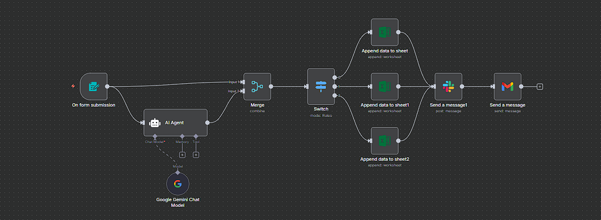

# Slack Complaint Integration and Logging

## Overview

A comprehensive complaint management system that handles employee/user feedback through web forms, automatically categorizes complaints using AI, logs all interactions in Excel, and sends instant notifications to relevant Slack channels. This workflow ensures no complaint goes unnoticed and provides complete audit trails.

## What It Does

- **Web Form Integration**: Captures user feedback through customizable web forms
- **AI-Powered Classification**: Automatically categorizes complaints using Google Gemini AI
- **Smart Routing**: Routes complaints to appropriate teams based on type
- **Complete Logging**: Records all complaint details in Microsoft Excel spreadsheets
- **Instant Notifications**: Sends automated alerts to Slack channels
- **Email Confirmations**: Provides acknowledgment emails to complainants

## Workflow Architecture

```
Form Submission → AI Classification → Merge Data → Switch Routing → Excel Logging → Slack Notification → Email Confirmation
```

### Detailed Workflow Steps

1. **Form Trigger**: Captures user submissions from web form with fields:

   - Full Name
   - Email Address
   - Contact Info (optional)
   - Feedback/Complaint

2. **AI Agent**: Uses Google Gemini to categorize feedback into:

   - Complain
   - Compliment
   - Feature Addition Request

3. **Data Merge**: Combines form data with AI classification results

4. **Switch Routing**: Routes complaints to different Excel sheets based on category

5. **Excel Logging**: Records complaint details in appropriate spreadsheets

6. **Slack Notification**: Posts complaint details to designated Slack channel

7. **Email Confirmation**: Sends acknowledgment email to complainant

## Business Value

- **Streamlined Complaint Handling**: Ensures every complaint is logged and routed correctly
- **Instant Team Notifications**: Relevant teams are notified immediately for quick response
- **Complete Audit Trail**: All interactions are recorded for compliance and analysis
- **Improved Response Times**: Automated routing reduces manual processing delays
- **Data-Driven Insights**: Centralized logging enables complaint pattern analysis

## APIs and Services Required

### Primary APIs

- **n8n Form Trigger** (Built-in)

  - Used for: Web form submission handling
  - Configuration: Customizable form fields and validation

- **Google Gemini API** (PaLM)

  - Model: Google Gemini Chat Model
  - Used for: AI-powered complaint categorization

- **Microsoft Excel API** (OAuth2)

  - Permissions: Read/Write access to specific workbooks
  - Used for: Complaint logging and tracking

- **Slack API** (OAuth2)

  - Permissions: Send messages to channels
  - Used for: Team notifications

- **Gmail API** (OAuth2)
  - Permissions: Send emails
  - Used for: Confirmation emails to complainants

### API Configuration

#### Google Gemini Setup

```json
{
  "credentials": {
    "googlePalmApi": {
      "id": "Your one",
      "name": "Google Gemini(PaLM) Api account 4"
    }
  }
}
```

#### Microsoft Excel Setup

```json
{
  "credentials": {
    "microsoftExcelOAuth2Api": {
      "id": "Your one",
      "name": "Microsoft Excel account"
    }
  }
}
```

#### Slack Setup

```json
{
  "credentials": {
    "slackOAuth2Api": {
      "id": "Your one",
      "name": "Slack account"
    }
  }
}
```

#### Gmail Setup

```json
{
  "credentials": {
    "gmailOAuth2": {
      "id": "Your one",
      "name": "Gmail account"
    }
  }
}
```

## Configuration

### Form Fields

- **Full Name**: Required text field
- **Email Address**: Required email field
- **Contact Info**: Optional number field
- **Feedback**: Required text area for complaint details

### AI Classification Categories

- **Complain**: General complaints and issues
- **Compliment**: Positive feedback and praise
- **Feature Addition Request**: Feature requests and suggestions

### Excel Logging Structure

Each category logs the following fields:

- Full Name
- Email Address
- Contact Info
- Feedback Content

### Slack Channel Configuration

- **Channel ID**: C09BRN78RC7 (all-amits-workspace)
- **Message Format**: Includes full complaint details
- **Notification Type**: Instant posting for immediate visibility

### Email Confirmation Template

- **Subject**: "Consideration of your Feedback"
- **Message**: Acknowledgment with promise to address the complaint
- **Tone**: Professional and reassuring

## Workflow Image



## Installation and Setup

1. **Import Workflow**: Import the `Feedback Form [Slack Integration].json` file into your n8n instance
2. **Configure Credentials**: Set up API credentials for Google Gemini, Microsoft Excel, Slack, and Gmail
3. **Customize Form**: Modify form fields and validation rules as needed
4. **Update Slack Channel**: Change the Slack channel ID to your designated complaint channel
5. **Test Configuration**: Submit test complaints to verify all integrations
6. **Activate Workflow**: Enable the workflow for production use

---

**Version**: 1.0  
**Last Updated**: August 2025  
**Compatibility**: n8n v1.0+  
**Author**: Amit Gangwar
