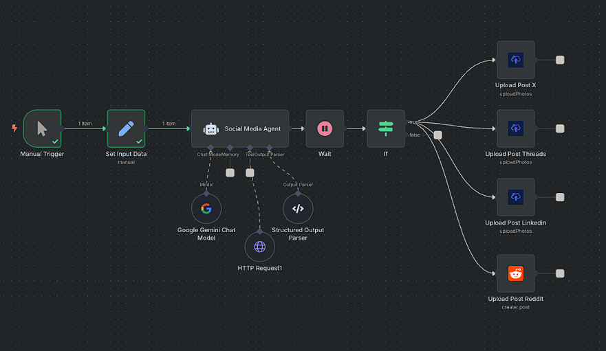

# SocioSync - Auto-Publish Web Articles as Social Posts

## Overview

SocioSync is an intelligent content automation system that transforms any web article, blog post, or news link into platform-specific social media posts using AI. It captures live screenshots of webpages and automatically publishes content across X (Twitter), LinkedIn, Threads, and Reddit, revolutionizing content sharing for marketers, content curators, and social media managers.

## What It Does

- **Content Analysis**: Uses AI to read and analyze any web URL for content extraction
- **Multi-Platform Publishing**: Generates unique posts for X, LinkedIn, Threads, and Reddit
- **Visual Enhancement**: Captures high-quality screenshots of source webpages
- **AI-Powered Content Creation**: Uses Google Gemini to create platform-specific posts
- **Human Review**: Includes approval workflow before publishing
- **Cross-Platform Distribution**: Automatically posts to multiple social networks

## Workflow Architecture

```
Manual Trigger → Input Data → AI Analysis → Screenshot Capture → Human Approval → Multi-Platform Publishing
```

### Detailed Workflow Steps

1. **Manual Trigger**: Initiates the workflow with URL input
2. **Input Data Setup**: Configures workflow URL, user credentials, and API keys
3. **AI Content Analysis**: Uses Google Gemini to analyze the webpage content
4. **Screenshot Generation**: Captures live screenshot using ScreenshotOne API
5. **Content Generation**: Creates platform-specific posts for each social network
6. **Human Review**: Presents generated content for approval
7. **Multi-Platform Publishing**: Posts approved content to X, LinkedIn, Threads, and Reddit

## Business Value

- **Time Savings**: Eliminates manual content creation and cross-platform posting
- **Consistency**: Maintains brand voice across all social platforms
- **Increased Reach**: Ensures content is optimized for each platform's audience
- **Visual Appeal**: Automatically generates engaging visuals for posts
- **Scalability**: Can handle multiple articles and content pieces efficiently

## APIs and Services Required

### Primary APIs

- **Google Gemini API** (PaLM)

  - Model: models/gemini-2.5-pro-preview-06-05
  - Used for: AI-powered content analysis and post generation

- **ScreenshotOne API**

  - Used for: Capturing high-quality webpage screenshots
  - Configuration: API key required

- **Upload-Post API** (Self-hosted n8n)

  - Used for: Publishing to X, LinkedIn, and Threads
  - Note: Requires self-hosted n8n instance

- **Reddit API**
  - Used for: Publishing to Reddit communities
  - Configuration: Subreddit targeting

### API Configuration

#### Google Gemini Setup

```json
{
  "credentials": {
    "googlePalmApi": {
      "id": "Your one",
      "name": "Google Gemini(PaLM) Api account 4"
    }
  }
}
```

#### ScreenshotOne Setup

```json
{
  "apiKey": "Add_key_screenshotOne"
}
```

## Configuration

### Input Parameters

- **workflow_url**: URL of the article or webpage to share
- **upload-post_user**: User identifier for upload-post service
- **ScreenshotOne_API_KEY**: API key for screenshot service

### AI Content Generation

The AI agent is configured to:

- Analyze webpage content and extract key information
- Generate platform-specific posts with appropriate tone and style
- Create engaging content for each social network
- Include relevant hashtags and calls-to-action
- Maintain brand voice and messaging consistency

### Platform-Specific Content

- **LinkedIn**: Professional, business-focused posts in Spanish
- **X (Twitter)**: Concise, engaging threads in English
- **Threads**: Conversational, relaxed tone in Spanish
- **Reddit**: Community-focused posts in English with titles

## Workflow Image



## Installation and Setup

1. **Import Workflow**: Import the `Auto-Publish Web Articles as Social Posts.json` file into your n8n instance
2. **Configure Credentials**: Set up API credentials for Google Gemini, ScreenshotOne, and social platforms
3. **Update Input Data**: Configure workflow URL and user parameters
4. **Test Configuration**: Run test executions to verify all integrations
5. **Connect Social Accounts**: Link your social media accounts for publishing
6. **Activate Workflow**: Enable the workflow for production use

## Who Is This For?

### Content Curators & Marketers

- Effortlessly share valuable industry news and articles
- Maintain consistent social media presence
- Save time on content creation and distribution

### Social Media Managers

- Keep social feeds consistently active
- Ensure high-quality, relevant content
- Reduce manual overhead and repetitive tasks

### Community Builders & Brand Evangelists

- Quickly disseminate product updates and tutorials
- Share blog posts and announcements efficiently
- Build community engagement across platforms

### Professionals & Thought Leaders

- Build personal brand through automated content sharing
- Share insightful articles with professional visuals
- Add unique perspective to industry discussions

---

**Version**: 1.0  
**Last Updated**: August 2025  
**Compatibility**: n8n v1.0+  
**Author**: Amit Gangwar
